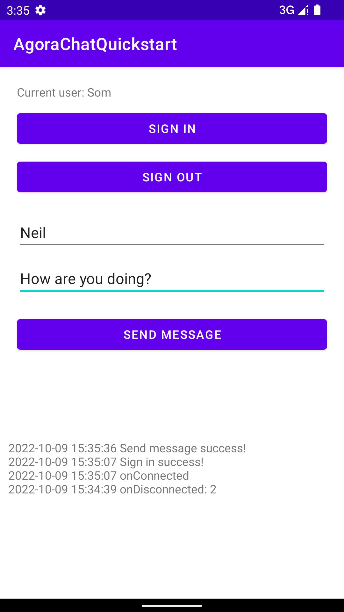
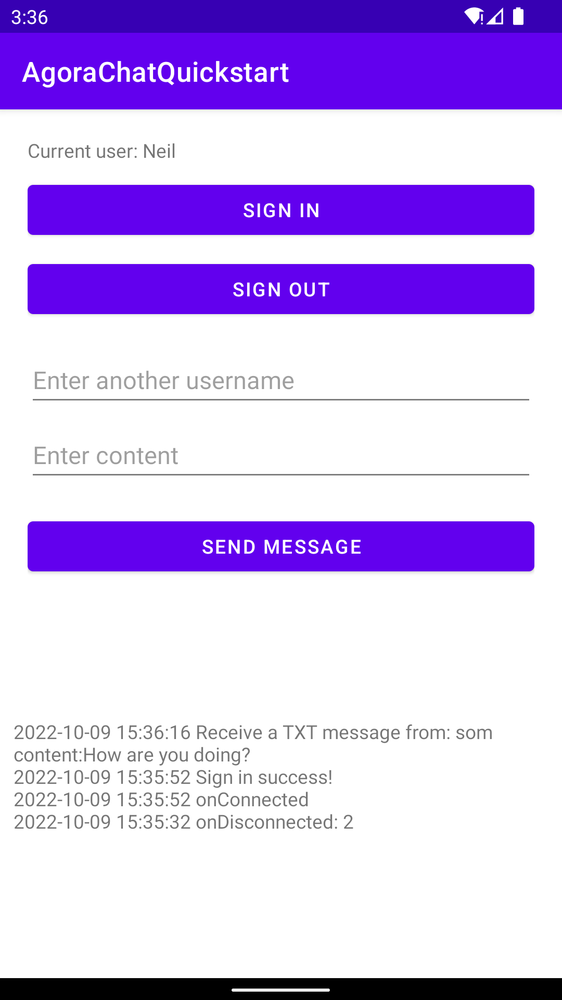

Instant messaging connects people wherever they are and allows them to communicate with others in real time. The Agora Chat SDK enables you to embed real-time messaging in any app, on any device, anywhere.

This page shows a sample code to add peer-to-peer messaging into your app by using the Agora Chat SDK for Android.

## Understand the tech

~338e0e30-e568-11ec-8e95-1b7dfd4b7cb0~

## Prerequisites

In order to follow the procedure in this page, you must have:

- An Android simulator or a physical Android device.
- Android Studio 3.2 or higher.
- Java Development Kit (JDK). You can refer to the [User Guide of Android](https://developer.android.com/studio/write/java8-support) for applicable versions.

## Token generation

This section describes how to register a user at Agora Console and generate a temporary token.

### Register a user

To generate a user ID, do the following:

1. On the **Project Management** page, click **Config** for the project you want to use.


2. Click **Config** for **Chat(Beta)** under **Features**.


3. Click **Create User** on the **User** page under **Operation Management**.


4. Fill in the user information and click **Save** to create a user.


### Generate a user token

To ensure communication security, Agora recommends using tokens to authenticate users logging in to an Agora Chat system.

For testing purposes, Agora Console supports generating Agora chat tokens. To generate an Agora chat token, do the following:

1. On the **Project Management** page, click **Config** for the project you want to use.
   
2. Click **Config** for **Chat(Beta)** under **Features** to open the **Application Information** page.
   
3. Under **Data Center**, enter the user ID in the **Chat User Temp Token** text box and click `Generate` to generate a token with user privileges.
   

## Project setup

Follow the steps to create the environment necessary to add video call into your app.

1. For new projects, in **Android Studio**, create a **Phone and Tablet** [Android project](https://developer.android.com/studio/projects/create-project) with an **Empty Activity**.
   <div class="alert note">After creating the project, <b>Android Studio</b> automatically starts gradle sync. Ensure that the sync succeeds before you continue.</div>

2. Integrate the Agora Chat SDK into your project with Maven Central. 

    a. In `/Gradle Scripts/build.gradle(Project: <projectname>)`, add the following lines to add the Maven Central dependency:

   ```java
   buildscript {
       repositories {
           ...
           mavenCentral()
       }
   }
   allprojects {
       repositories {
           ...
           mavenCentral()
       }
   }
   ```
	 
	 <div class="alert note">The way to add the Maven Central dependency can be different if you set  <a href="https://docs.gradle.org/current/userguide/declaring_repositories.html#sub:centralized-repository-declaration">dependencyResolutionManagement</a> in your Android project.</div>
		
	b. In `/Gradle Scripts/build.gradle(Module: <projectname>.app)`, add the following lines to integrate the Agora Chat SDK into your Android project:

   ```java
   android {
       defaultConfig {
               // The Android OS version should be 21 or higher.
               minSdkVersion 21
       }
       compileOptions {
           sourceCompatibility JavaVersion.VERSION_1_8
           targetCompatibility JavaVersion.VERSION_1_8
       }
   }
   dependencies {
       ...
       implementation 'io.agora.rtc:chat-sdk:X.Y.Z'
   }
   ```

   <div class="alert note"><ul><li><code>minSdkVersion</code> must be 21 or higher for the build process to succeed.</li><li>For the latest SDK version, go to <a href="https://search.maven.org/search?q=a:chat-sdk">Sonatype</a>.</li></ul></div>

3. Add permissions for network and device access.

   In `/app/Manifests/AndroidManifest.xml`, add the following permissions after `</application>`:
	 
   ```xml
   <uses-permission android:name="android.permission.INTERNET" />
   <uses-permission android:name="android.permission.ACCESS_NETWORK_STATE"/>
   <uses-permission android:name="android.permission.WAKE_LOCK"/>
   ```
	
	These are the minimum permissions you need to add to start Agora Chat. You can also add other permissions according to your use case.

4. Prevent code obfuscation.

   In `/Gradle Scripts/proguard-rules.pro`, add the following line:

   ```java
   -keep class io.agora.** {*;}
   -dontwarn  io.agora.**
   ```


## Implement peer-to-peer messaging

This section shows how to use the Agora Chat SDK to implement peer-to-peer messaging in your app step by step.

### Create the UI

1. To add the text strings used by the UI, open `app/res/values/strings.xml ` and  replace the content with the following codes:

   ```xml
   <resources>
       <string name="app_name">AgoraChatQuickstart</string>
   </resources>
   ``` 

2. To add the UI framework, open  `app/res/layout/activity_main.xml` and replace the content with the following codes:

   ```xml
   <?xml version="1.0" encoding="utf-8"?>
   <LinearLayout xmlns:android="http://schemas.android.com/apk/res/android"
       android:layout_width="match_parent"
       android:layout_height="match_parent"
       android:orientation="vertical">
   
       <ScrollView
           android:layout_width="match_parent"
           android:layout_height="0dp"
           android:layout_weight="1">
   
           <LinearLayout
               android:layout_width="match_parent"
               android:layout_height="wrap_content"
               android:orientation="vertical"
               android:gravity="center_horizontal"
               android:layout_marginStart="20dp"
               android:layout_marginEnd="20dp">
   
               <TextView
                   android:id="@+id/tv_username"
                   android:layout_width="match_parent"
                   android:layout_height="wrap_content"
                   android:hint="Username"
                   android:layout_marginTop="20dp"/>
   
               <Button
                   android:id="@+id/btn_sign_in"
                   android:layout_width="0dp"
                   android:layout_height="wrap_content"
                   android:text="@string/sign_in"
                   android:onClick="signInWithToken"
                   app:layout_constraintLeft_toLeftOf="parent"
                   app:layout_constraintTop_toBottomOf="@id/et_pwd"
                   app:layout_constraintRight_toLeftOf="@id/btn_sign_out"
                   android:layout_marginStart="10dp"
                   android:layout_marginEnd="5dp"
                   android:layout_marginTop="10dp"/>
   
               <Button
                   android:id="@+id/btn_sign_out"
                   android:layout_width="0dp"
                   android:layout_height="wrap_content"
                   android:text="@string/sign_out"
                   android:onClick="signOut"
                   app:layout_constraintLeft_toRightOf="@id/btn_sign_in"
                   app:layout_constraintTop_toBottomOf="@id/et_pwd"
                   app:layout_constraintRight_toLeftOf="@id/btn_sign_up"
                   android:layout_marginStart="5dp"
                   android:layout_marginEnd="5dp"
                   android:layout_marginTop="10dp"/>
   
               <EditText
                   android:id="@+id/et_to_chat_name"
                   android:layout_width="0dp"
                   android:layout_height="wrap_content"
                   android:hint="@string/enter_to_send_name"
                   app:layout_constraintLeft_toLeftOf="parent"
                   app:layout_constraintRight_toRightOf="parent"
                   app:layout_constraintTop_toBottomOf="@id/btn_sign_in"
                   android:layout_marginStart="20dp"
                   android:layout_marginEnd="20dp"
                   android:layout_marginTop="20dp"/>
   
               <EditText
                   android:id="@+id/et_msg_content"
                   android:layout_width="0dp"
                   android:layout_height="wrap_content"
                   android:hint="@string/enter_content"
                   app:layout_constraintLeft_toLeftOf="parent"
                   app:layout_constraintRight_toRightOf="parent"
                   app:layout_constraintTop_toBottomOf="@id/et_to_chat_name"
                   android:layout_marginStart="20dp"
                   android:layout_marginEnd="20dp"
                   android:layout_marginTop="10dp"/>
   
               <Button
                   android:id="@+id/btn_send_message"
                   android:layout_width="0dp"
                   android:layout_height="wrap_content"
                   android:text="@string/send_message"
                   android:onClick="sendFirstMessage"
                   app:layout_constraintLeft_toLeftOf="parent"
                   app:layout_constraintRight_toRightOf="parent"
                   app:layout_constraintTop_toBottomOf="@id/et_msg_content"
                   android:layout_marginStart="10dp"
                   android:layout_marginEnd="10dp"
                   android:layout_marginTop="20dp"/>
   
           </LinearLayout>
   
       </ScrollView>
   
       <TextView
           android:id="@+id/tv_log"
           android:layout_width="match_parent"
           android:layout_height="200dp"
           android:hint="@string/log_hint"
           android:scrollbars="vertical"
           android:padding="10dp"/>
   
   </LinearLayout>
   ```

### Implement the sending and receiving of messages

To enable your app to send and receive messages between individual users, do the following:

1. Import classes. In  `app/java/io.agora.agorachatquickstart/MainActivity`, add the following lines after `import android.os.Bundle;` :

   ```java
   import android.text.TextUtils;
   import android.text.method.ScrollingMovementMethod;
   import android.view.View;
   import android.widget.TextView;
   import android.widget.Toast;
   import androidx.appcompat.app.AppCompatActivity;
   import java.text.SimpleDateFormat;
   import java.util.Date;
   import java.util.Locale;
   import io.agora.CallBack;
   import io.agora.ConnectionListener;
   import io.agora.chat.ChatClient;
   import io.agora.chat.ChatMessage;
   import io.agora.chat.ChatOptions;
   import io.agora.chat.TextMessageBody;
   ```
   
2. Define global variables. In `app/java/io.agora.agorachatquickstart/MainActivity`,  before adding the following lines after `AppCompatActivity {`, ensure you delete the `onCreate` funtion created by default.

   ```java
   // Create a user from Agora Console or by your app server
   private static final String USERNAME = "<Your username>";
   // Gets token from Agora Console or generates by your app server
   private static final String TOKEN = "<Your token>";
   // Gets AppKey from Agora Console
   private static final String APP_KEY = "<Your AppKey>";
   
   @Override
   protected void onCreate(Bundle savedInstanceState) {
       super.onCreate(savedInstanceState);
       setContentView(R.layout.activity_main);
       // Add methods for initialization and listen for message and connection events.
       initView();
       initSDK();
       addMessageListener();
       addConnectionListener();
   }
   ```
   
3. Initialize the view and the app. In `app/java/io.agora.agorachatquickstart/MainActivity`, add the following lines after the `onCreate` function: 

   ```java
   // Initialize the view.
   private void initView() {
       ((TextView)findViewById(R.id.tv_log)).setMovementMethod(new ScrollingMovementMethod());
   }
   // Initialize the SDK.
   private void initSDK() {
       ChatOptions options = new ChatOptions();
       // Get your appkey applied from Agora Console
       if(TextUtils.isEmpty(APP_KEY)) {
           Toast.makeText(MainActivity.this, "You should set your AppKey first!", Toast.LENGTH_SHORT).show();
           return;
       }
       // Set your appkey to options
       options.setAppKey(APP_KEY);
       // To initialize Agora Chat SDK
       ChatClient.getInstance().init(this, options);
       // Make Agora Chat SDK debuggable
       ChatClient.getInstance().setDebugMode(true);
       // Show current user
       ((TextView)findViewById(R.id.tv_username)).setText("Current user: "+USERNAME);
   }
   ```

4. Add event callbacks. In `app/java/io.agora.agorachatquickstart/MainActivity`, add the following lines after the `initSDK` function:

   ```java
   private void initListener() {
       // Add message events callbacks.
       ChatClient.getInstance().chatManager().addMessageListener(messages -> {
           for(ChatMessage message : messages) {
               StringBuilder builder = new StringBuilder();
               builder.append("Receive a ").append(message.getType().name())
                       .append(" message from: ").append(message.getFrom());
               if(message.getType() == ChatMessage.Type.TXT) {
                   builder.append(" content:")
                           .append(((TextMessageBody)message.getBody()).getMessage());
               }
               showLog(builder.toString(), false);
           }
       });
       // Add connection events callbacks.
       ChatClient.getInstance().addConnectionListener(new ConnectionListener() {
           @Override
           public void onConnected() {
               showLog("onConnected",false);
           }

          @Override
          public void onDisconnected(int error) {
              showLog("onDisconnected: "+error,false);
          }

          @Override
          public void onLogout(int errorCode) {
              showLog("User needs to log out: "+errorCode, false);
              ChatClient.getInstance().logout(false, null);
          }
          // This callback occurs when the token expires. When the callback is triggered, the app client must get a new token from the app server and logs in to the app again.
          @Override
          public void onTokenExpired() {
              showLog("ConnectionListener onTokenExpired", true);
          }
          // This callback occurs when the token is to expire. 
          @Override
          public void onTokenWillExpire() {
              showLog("ConnectionListener onTokenWillExpire", true);
          }
      });
   }
   
       public void execute(Runnable runnable) {
           new Thread(runnable).start();
       }
   ```

5. Create a user account, log in to the app. To implement this logic, in `app/java/io.agora.agorachatquickstart/MainActivity`, add the following lines after the `initListener` function:

   ```java
   // Log in with Token.
   public void signInWithToken(View view) {
       loginToAgora();
   }

   private void loginToAgora() {
       if(TextUtils.isEmpty(USERNAME) || TextUtils.isEmpty(TOKEN)) {
           showLog("Username or token is empty!", true);
           return;
       }
       ChatClient.getInstance().loginWithAgoraToken(USERNAME, TOKEN, new CallBack() {
           @Override
           public void onSuccess() {
               showLog("Sign in success!", true);
           }

           @Override
           public void onError(int code, String error) {
               showLog(error, true);
           }
       });
   }
   
   // Sign out.
   public void signOut(View view) {
       if(ChatClient.getInstance().isLoggedInBefore()) {
           ChatClient.getInstance().logout(true, new CallBack() {
               @Override
               public void onSuccess() {
                   showLog("Sign out success!", true);
               }

               @Override
               public void onError(int code, String error) {
                   showLog(error, true);
               }
           String preContent = tvLog.getText().toString().trim();
           StringBuilder builder = new StringBuilder();
           builder.append(formatCurrentTime())
                   .append(" ")
                   .append(content)
                   .append("\n")
                   .append(preContent);
           tvLog.post(()-> {
               tvLog.setText(builder);
           });
       }else {
           showLog("You were not logged in", false);
       }
   }
   ```

6. Start a chat. To enable the function of sending messages, add the following lines after the `signOut` function:

   ```java
   // Send your first message.
   public void sendFirstMessage(View view) {
       String toSendName = ((EditText)findViewById(R.id.et_to_chat_name)).getText().toString().trim();
       String content = ((EditText)findViewById(R.id.et_msg_content)).getText().toString().trim();
       // Create a text message
       ChatMessage message = ChatMessage.createTextSendMessage(content, toSendName);
       // Set the message callback before sending the message
       message.setMessageStatusCallback(new CallBack() {
           @Override
           public void onSuccess() {
               showLog("Send message success!", true);
           }

           @Override
           public void onError(int code, String error) {
               showLog(error, true);
           }
       });
       // Send the message
       ChatClient.getInstance().chatManager().sendMessage(message);
   }
   ```

7. Show log. To show log, add the following lines after the `sendFirstMessage` function:

   ```java
   // Show log.
   private void showLog(String content, boolean showToast) {
       if(TextUtils.isEmpty(content)) {
           return;
       }
       runOnUiThread(()-> {
           if(showToast) {
               Toast.makeText(this, content, Toast.LENGTH_SHORT).show();
           }
           TextView tv_log = findViewById(R.id.tv_log);
           String preContent = tv_log.getText().toString().trim();
           StringBuilder builder = new StringBuilder();
           builder.append(new SimpleDateFormat("yyyy-MM-dd HH:mm:ss", Locale.getDefault()).format(new Date()))
                   .append(" ").append(content).append("\n").append(preContent);
           tv_log.setText(builder);
       });
   }
   ```

8. Click `Sync Project with Gradle Files` to sync your project. Now you are ready to test your app.

## Test your app

To validate the peer-to-peer messaging you have just integrated into your app using Agora Chat:

1. In Android Studio, click `Run 'app'`.

   You see the following interface on your simulator or physical device: 
   

2. Sign in with the user account and send a message.
   

3. Run the app on another Android device or simulator with another user account. Ensure that the usernames are unique.

4. Send messages between the users.
   

## Next Steps

For demonstration purposes, Agora Chat provides an app server that enables you to quickly retrieve a token using the App Key given in this guide. In a production context, the best practice is for you to deploy your own token server, use your own [App Key](./enable_agora_chat?platform=Android#get-the-information-of-the-agora-chat-project) to generate a token, and retrieve the token on the client side to log in to Agora. To see how to implement a server that generates and serves tokens on request, see [Generate a User Token](./generate_user_tokens?platform=All%20Platforms).

## See also

In addition to integrating the Agora Chat SDK into your project with mavenCentral, you can also manually download the [Agora Chat SDK for Android](https://download.agora.io/sdk/release/Agora_Chat_SDK_for_Android_v1.0.0.zip). 

1. Download the latest version of the Agora Chat SDK for Android, and extract the files from the downloaded SDK package.

2. Copy the following files or subfolders from the **libs** folder of the downloaded SDK to the corresponding directory of your project.

   | File or subfolder                                      | Path of your project                  |
   | ------------------------------------------------------ | ------------------------------------- |
   | `agorachat_X.Y.Z.jar`                                  | `~/app/libs/`                         |
   | `/arm64-v8a/libagora-chat-sdk.so` and `libsqlite.so`   | `~/app/src/main/jniLibs/arm64-v8a/`   |
   | `/armeabi-v7a/libagora-chat-sdk.so` and `libsqlite.so` | `~/app/src/main/jniLibs/armeabi-v7a/` |
   | `/x86/libagora-chat-sdk.so` and `libsqlite.so`         | `~/app/src/main/jniLibs/x86/`         |
   | `/x86_64/libagora-chat-sdk.so` and `libsqlite.so`      | `~/app/src/main/jniLibs/x86_64/`      |

   <div class="alert info"> X.Y.Z refers to the version number of the Agora Chat SDK you downloaded.<div>