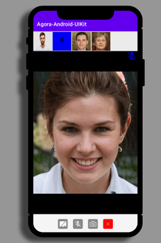

# Get started with Video Call using UIKit

Real-time video chatting immerses people in the sights and sounds of human connections. This keeps your users engaged for longer with your app. Agora Video SDK makes it easy for you to manage video calls and interactive live streaming events in an app. UIKit is a library that combines Agora real-time engagement functionality into a customizable user interface. Have another coffee, we have done all the work for you.



This page shows the minimum code you need to add a real-time engagement interface into your app using UIKit.

## Understand the tech

The following figure shows the workflow UIKit integrates into your app in order to create Video Call functionality.


To start a call using UIKit, you implement the following steps in your app:

1. **Join a channel**

   The `join` command joins the channel, publishes the local audio and video streams to Agora and handles audio and video for anyone else who joins the call in a default UI.


Yes, you read that right. After inializing an `AgoraVideoViewer` instance, you manage a call with one line of code. 


## Prerequisites

- Xcode 9.0 or later.
- Two iOS devices running iOS 8.0 or later
- - A computer that can access the Internet.

    Ensure that no firewall is deployed in your network environment, otherwise the project fails.

- A valid [Agora account](https://docs.agora.io/en/Agora%20Platform/sign_in_and_sign_up) and an Agora project.


## Project setup

In order to create the environment necessary to integrate Video Call into your app using UIKit, do the following:


1. [Create a new project](https://help.apple.com/xcode/mac/current/#/dev07db0e578) for an iOS app using the **Single View App** template. Make sure you select **Storyboard** as the user interface.

   If you have not added any team information, you see the <b>Add account...</b> button. Click it, input your Apple ID, and click <b>Next</b>. Your team information is added to the project. 

2. [Enable automatic signing](https://help.apple.com/xcode/mac/current/#/dev23aab79b4) for your project.

3. [Set the target devices](https://help.apple.com/xcode/mac/current/#/deve69552ee5) to deploy your iOS app.

4. Add project permissions for microphone and camera usage.

   Open the `info.plist ` in the project navigation panel, and add the following properties to the [property list](https://help.apple.com/xcode/mac/current/#/dev3f399a2a6):

   | key                                  | type   | value                                                                                       |
      | :----------------------------------- | :----- | :------------------------------------------------------------------------------------------ |
   | NSMicrophoneUsageDescription | String | Access the microphone for Agora Video Calls or Interactive Live Streaming events.      |
   | NSCameraUsageDescription    | String | Access the camera for Agora Video Calls or Interactive Live Streaming events.                     |

5. Integrate the UIKit into your project.

   1. Go to **File** > **Swift Packages** > **Add Package Dependencies...**, and paste the following link:

      `https://github.com/AgoraIO/AgoraRtcEngine_iOS`

   2. In the next sheet, [specify the latest version](https://help.apple.com/xcode/mac/current/#/devb83d64851) and click **Next**, then click **Finish** when you see **AgoraUIKit_iOS**. 

## Implement a client for Video Call

This section shows how to use UIKit to implement Video Call into your app step-by-step.

To integrate real-time video in a ready-made user interface into your app:

1. Import the Agora classes:

   In `ViewController.swift`, add the following line after `import UIKit`:
   ```swift
   import AgoraUIKit_iOS 
   ```
2. Create the variables that you use to initiate and join a channel:

    In `ViewController.swift`, add the following line after `class ViewController: UIViewController {`:
   ```swift
    // Fill the App ID of your project generated on Agora Console.
    let appId = ""

    // Fill the temp token generated on Agora Console.
    let token = ""

    // Fill the channel name.
    let channelName = ""
   ```

3. Create a function that initializes an `AgoraVideoViewer` instance and joins a channel: 
    
   In `ViewController.swift`, add the following line after ` let channelName = ""`:

   ```swift
   func initializeAndJoinChannel(){

      let agoraKit = AgoraVideoViewer(
         connectionData: AgoraConnectionData(
            appId: appId
         ),
         style: .grid
      )
        
      agoraKit.join(
        channel: channelName,
        with: token,
        as: .broadcaster
      )
    }
   ```
   
4. Start your app:

   In `ViewController.swift`, update `viewDidLoad` to run  `initializeAndJoinChannel()` when the app starts. For example:
   ```swift
    override func viewDidLoad() {
        super.viewDidLoad()
        // Do any additional setup after loading the view.
        initializeAndJoinChannel()
    }
   ```

## Test your app

To check that your code works, use an online demo to make a video call to your app. to do this:

1. [Generate a temporary token](https://docs.agora.io/en/Agora%20Platform/get_appid_token?platform=All#generate-a-temporary-token) in Agora Console.

2. In your browser, navigate to https://agora-scalableui-android-test.netlify.app/ and update _App ID_, _Channel_ and _Token_ with the values for your temporary token, then click *JOIN*.

3. In XCode, in `ViewController.swift`, update `appId`, `channelName` and `token` with the values for your temporary token. 
4. Run your app.