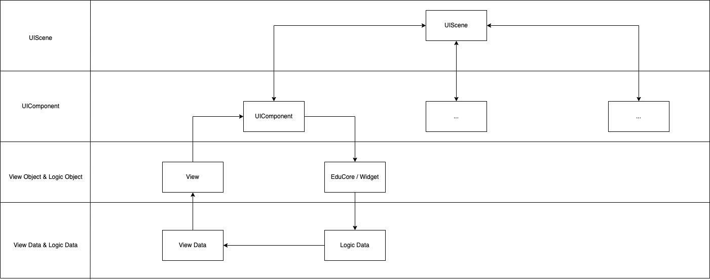

## 教室与 UI 组件介绍

### 数据交互流程

灵动课堂的 UI 层和核心业务逻辑层是相隔离，独立成 **UI** 和 **Core** 两个库。以灵动课堂-教育场景的设备开关功能为例，通过一个按钮改变设备状态。为实现该功能，我们在 `AgoraEduUI` 中调用 `AgoraEduMediaContext` 的 `openLocalDevice` 方法，并监听 `AgoraEduMediaHandler` 抛出的设备状态改变相关事件。

数据流转示意图如下：


### 教室和 UI 组件结构说明

`AgoraEduUI` 中包含灵动课堂的 UI 组件代码。`AgoraEduUI` 的源码位于 GitHub 上 CloudClass-iOS 仓库 `/SDKs/AgoraEduUI/Classes` 目录下，核心项目结构介绍如下：

| 文件夹         | 描述                                                         |
| :------------- | :----------------------------------------------------------- |
| `/Scenes`       | 在灵动课堂中提供场景的 `UIScene`，如一对一课堂、小班课等。 |
| `/Components`  | 灵动课堂使用的 UI 组件 	`UIComponent`，如花名册、状态栏等。 |
| `/Configs`      | 灵动课堂的 UI 配置，用于设置颜色，字体，图片等 |
| `/Views` | 灵动课堂使用的 UI 元素，如视频渲染窗口、设置界面等。         |
| `/Models` | 用于在 `AgoraEduUI` 中的数据模型。 |

### 类型说明

-   `UIScene`

    -   一个 `UIScene` 对应一种班型场景，类型为 `UIViewController`。
    -   `UIScene` 管理多个 `UIComponent`，负责 `UIComponent` 之间的通讯。
    -   `UIScene` 持有一个 `contextPool` 对象，用于使用 `AgoraEduCore` 层的能力。

-   `UIComponent`
    -   一个 `UIComponent` 对应一个 UI 组件，类型为 `UIViewController`。
    -   `UIComponent` 的 view 是 `UIScene.contentView` 的 subView，用于该功能的占位。
    -   `UIComponent` 位于 `AgoraEduUI` 库的 `/Components` 文件夹下，分为以下两种：
        -   `FlatComponents`: 平铺类型的 UI 组件。
        -   `SuspendComponents`: 弹窗类型的 UI 组件。
        

### UI 结构示意图



## 自定义课堂 UI

本节以灵动课堂-教育场景为例，介绍自定义课堂 UI 的具体步骤。

### 1. 获取灵动课堂源码

如需修改灵动课堂的默认 UI，你需要通过下载 GitHub 源码的方式集成灵动课堂，步骤如下：

1. 运行以下命令将 [CloudClass-iOS](https://github.com/AgoraIO-Community/CloudClass-iOS) 和 [apaas-extapp-ios](https://github.com/AgoraIO-Community/apaas-extapp-ios) 项目克隆至本地，并切换至最新发版分支。

   ```bash
   git clone https://github.com/AgoraIO-Community/CloudClass-iOS.git 
   ```

   ```bash
   git clone https://github.com/AgoraIO-Community/apaas-extapp-ios.git
   ```

2. 通过 `git remote add <shortname> <url>` 命令为 **CloudClass-iOS** 和 **apaas-extapp-ios** 仓库添加远端仓库，指向你的项目仓库。

3. 基于最新的发版分支创建一个你自己的分支，推向你的项目仓库。

4. 在你的项目的 `Podfile` 文件中添加如下代码引用 CloudClass-iOS 项目中的 `AgoraClassroomSDK_iOS.podspec`、`AgoraEduUI.podspec` 和 apaas-extapp-ios 项目中的 `AgoraWidgets.podspec` 以及其它依赖的库。

   ```
   # third libs
   pod 'Protobuf', '3.17.0'
   pod 'CocoaLumberjack', '3.6.1'
   pod 'AliyunOSSiOS', '2.10.8'
   pod 'Armin', '1.1.0'
   pod 'SSZipArchive', '2.4.2'
   pod 'SwifterSwift', '5.2.0'
   pod 'Masonry', '1.1.0'
   pod 'SDWebImage', '5.12.0'
   
   # agora libs
   pod 'AgoraRtcEngine_iOS/RtcBasic', '3.6.2'
   pod 'AgoraMediaPlayer_iOS', '1.3.0'
   pod 'AgoraRtm_iOS', '1.4.8'
   pod 'Agora_Chat_iOS', '1.0.6'
   pod 'Whiteboard', '2.16.39'
    
   # open source libs
   pod 'AgoraClassroomSDK_iOS', :path => '../CloudClass-iOS/AgoraClassroomSDK_iOS.podspec'
   pod 'AgoraEduUI', :path => '../CloudClass-iOS/AgoraEduUI.podspec'
   pod 'AgoraWidgets', :path => '../apaas-extapp-ios/AgoraWidgets.podspec'
    
   # close source libs
   pod 'AgoraUIBaseViews', '2.8.0'
   pod 'AgoraEduCore', '2.8.0'
   pod 'AgoraWidget', '2.8.0'
   ```

### 2. 修改现有的 UI 组件

#### 示例一：修改导航栏的颜色与布局

你可通过以下三种方式修改导航栏的颜色：

- 方式一：直接修改 `RoomStateUIComponent` 中的代码。

- 方式二：通过修改 UIConfigs 中的 `FcrUIComponentStateBar` 的 `backgroundColor`

以下为方式二的示例代码：

**修改前**

```
struct FcrUIComponentStateBar: FcrUIComponentProtocol {
    var visible: Bool = true
    var enable: Bool = true
    var backgroundColor: UIColor = FcrUIColorGroup.systemForegroundColor
    
    /**Scene Builder Set**/
    var networkState = FcrUIItemStateBarNetworkState()
    var roomName = FcrUIItemStateBarRoomName()
    var scheduleTime = FcrUIItemStateBarScheduleTime()
    /**iOS**/
    let sepLine = FcrUIItemSepLine()
    
    let borderWidth = FcrUIFrameGroup.borderWidth
    let borderColor = FcrUIColorGroup.systemDividerColor
}
```


**修改后**

```
struct FcrUIComponentStateBar: FcrUIComponentProtocol {
    var visible: Bool = true
    var enable: Bool = true
    var backgroundColor: UIColor = .systemTeal
    
    /**Scene Builder Set**/
    var networkState = FcrUIItemStateBarNetworkState()
    var roomName = FcrUIItemStateBarRoomName()
    var scheduleTime = FcrUIItemStateBarScheduleTime()
    /**iOS**/
    let sepLine = FcrUIItemSepLine()
    
    let borderWidth = FcrUIFrameGroup.borderWidth
    let borderColor = FcrUIColorGroup.systemDividerColor
}
```


#### 示例二：修改花名册图片资源

花名册 UI 组件的代码主要位于以下两个文件中：

- CloudClass-iOS/SDKs/AgoraEduUI/Classes/Components/SuspendComponents/FcrRosterUIController.swift
- CloudClass-iOS/SDKs/AgoraEduUI/Classes/Views/UserList/AgoraUserListItemCell.swift

花名册 UI 组件应用于学生端小班课、教师端小班课、教师端大班课教室中。教师端可以操作花名册，学生端不可操作。学生信息列表中包含学生姓名、上下台、白板授权、摄像头、麦克风、奖励六栏，如下图所示：


其中：

- 上下台和白板授权仅有 **true** 和 **false** 两种状态。
- 摄像头和麦克风有**未上台+不可操作**、**已上台+设备关闭**、**已上台+设备开启+发流权限关闭**、**已上台+设备开启+发流权限开启**四种状态。

花名册的数据源如下：

- 学生总人数的变化和上台人数变化由 `AgoraEduUserHandler` 中的回调报告。
- 麦克风状态和摄像头状态由 `AgoraEduStreamHandler` 中的回调报告。
- 白板授权状态由 ID 为 `netlessBoard` 的 Widget 消息报告。

以摄像头状态为例，数据流转过程如下：

1. 当流状态发生变化，会触发 `AgoraEduStreamHandler` 的 `onStreamUpdated` 回调，然后通过 `updateModel` 方法更新数据源。
2. 数据源更新完成后，调用 `tableView.reloadData()` 刷新 tableView 的每个 Cell。
3. 在 `AgoraUserListItemCell` 的 `updateState` 方法中刷新图标。

因此，如果我们想更新学生端小班课中花名册的摄像头图标，可参考以下步骤：

1. 将新的摄像头图标 **new_camera_on** 和 **new_camera_off** 放置于 `AgoraEduUI/AgoraEduUI/Assets/images.xcassets/NameRoll` 文件夹中：

   

2. 更新 `AgoraUserListItemCell.swift` 文件中的代码。

**修改前**

```swift
// colors
let onColor = UIColor(hex: 0x0073FF)
let offColor = UIColor(hex: 0xF04C36)
let disabledColor = UIColor(hex: 0xE2E2EE)
  
// state
case .camera:
    if !model.stageState.isOn {
        // unCohost
        let image = UIImage.agedu_named("ic_nameroll_camera_on")
        if let i = image?.withRenderingMode(.alwaysTemplate) {
            cameraButton.setImageForAllStates(i)
        }
        cameraButton.tintColor = disabledColor
    } else if !model.cameraState.deviceOn {
        // cohost + device off
        let image = UIImage.agedu_named("ic_nameroll_camera_off")
        if let i = image?.withRenderingMode(.alwaysTemplate) {
            cameraButton.setImageForAllStates(i)
        }
        cameraButton.tintColor = disabledColor
    } else if !model.cameraState.streamOn {
        // cohost + device on + no video stream privilege
        let image = UIImage.agedu_named("ic_nameroll_camera_off")
        if let i = image?.withRenderingMode(.alwaysTemplate) {
            cameraButton.setImageForAllStates(i)
        }
        cameraButton.tintColor = offColor
    } else {
        // cohost + device on + video stream privilege
        let image = UIImage.agedu_named("ic_nameroll_camera_on")
        if let i = image?.withRenderingMode(.alwaysTemplate) {
            cameraButton.setImageForAllStates(i)
        }
        cameraButton.tintColor = onColor
    }
    cameraButton.isUserInteractionEnabled = model.cameraState.isEnable
```

**修改后**

```swift
case .camera:
    if !model.stageState.isOn {
        // unCohost
        let image = UIImage.agedu_named("new_camera_on")
        if let i = image?.withRenderingMode(.alwaysTemplate) {
            cameraButton.setImageForAllStates(i)
        }
        cameraButton.tintColor = disabledColor
    } else if !model.cameraState.deviceOn {
        // cohost + device off
        let image = UIImage.agedu_named("new_camera_off")
        if let i = image?.withRenderingMode(.alwaysTemplate) {
            cameraButton.setImageForAllStates(i)
        }
        cameraButton.tintColor = disabledColor
    } else if !model.cameraState.streamOn {
        // cohost + device on + no video stream privilege
        let image = UIImage.agedu_named("new_camera_off")
        if let i = image?.withRenderingMode(.alwaysTemplate) {
            cameraButton.setImageForAllStates(i)
        }
        cameraButton.tintColor = offColor
    } else {
        // cohost + device on + video stream privilege
        let image = UIImage.agedu_named("new_camera_on")
        if let i = image?.withRenderingMode(.alwaysTemplate) {
            cameraButton.setImageForAllStates(i)
        }
        cameraButton.tintColor = onColor
    }
    cameraButton.isUserInteractionEnabled = model.cameraState.isEnable
```


### 3. 新增 UI 组件

新增 UI 组件的基本步骤如下：

1. 在 `CloudClass-iOS/SDKs/AgoraEduUI/Classes/Components` 文件夹中新增一个 `UIComponent` 类。
2. 在 `UIScene` 中创建该 `UIComponent` 对象并添加视图。

