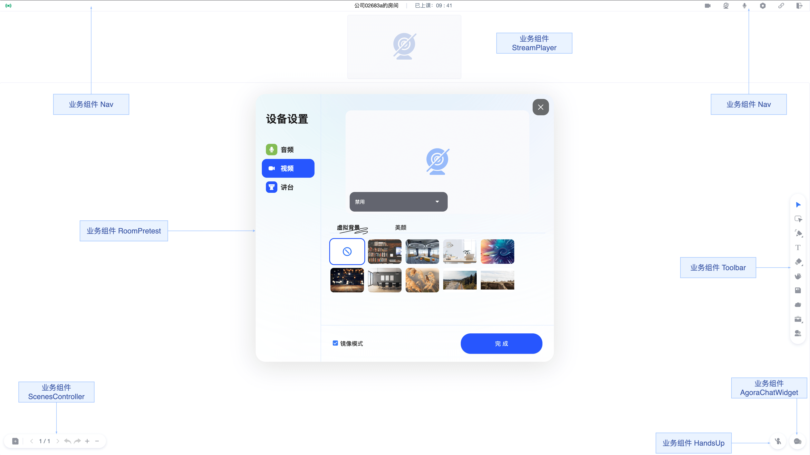
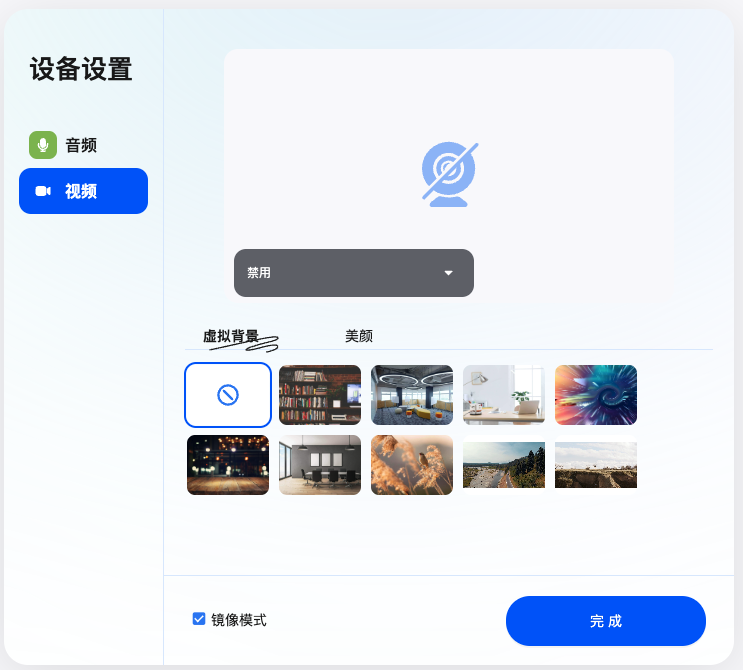
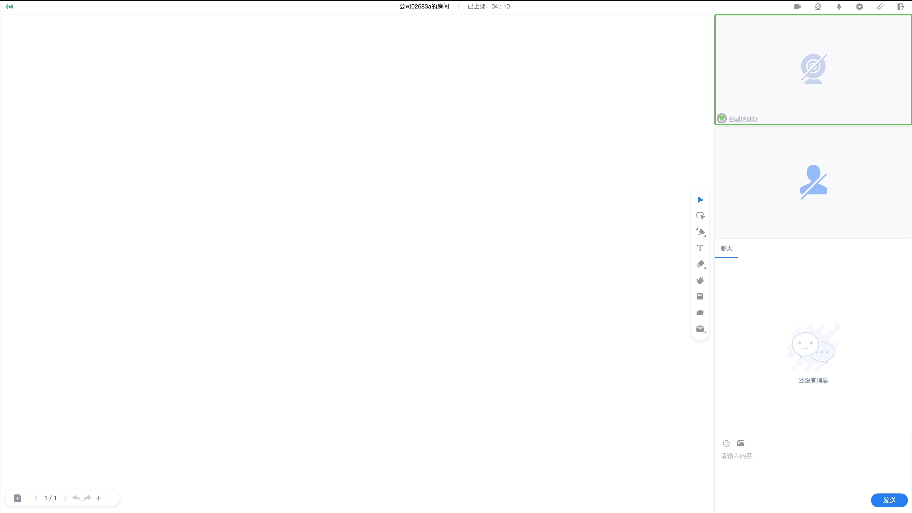
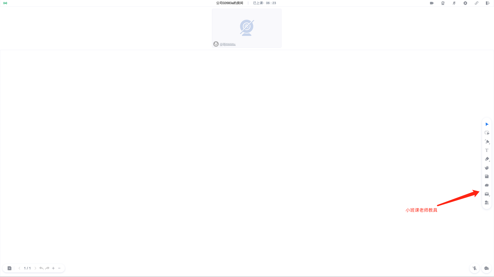
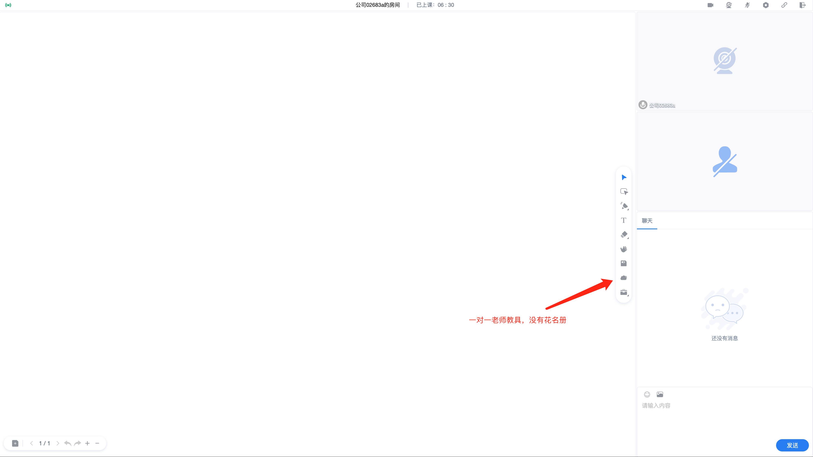

## UI 组件介绍

灵动课堂的 UI 组件可分为功能组件、业务组件和场景组件三种。

### 功能组件

功能组件是灵动课堂中最基础的 UI 组件，不和业务逻辑绑定。一个功能组件维护一个功能的内部状态和逻辑，例如 `Button`、`Modal`、`Select`、 `Tree` 等。

功能组件位于 `packages/agora-classroom-sdk/ui-kit`(灵动课堂 - 教育场景) 和 `packages/agora-proctor-sdk/ui-kit`(灵动课堂 - 监考场景) 目录中，采用 `react`+`ts`+`storybook` 架构。每个功能组件文件夹均包含以下三个文件：

-   `.tsx`: 实现 UI 组件的功能。
-   `.css`: 实现 UI 组件的样式。
-   `.stories.tsx`: 用于 UI 组件在 Storybook 中的预览和调试。开发者可通过 `yarn dev:ui-kit ` 或 `npm run dev:ui-kit` 命令启动项目，在 Storybook 中查看各功能组件。

下表详细介绍灵动课堂中使用的功能组件：

| 文件夹          | 功能组件                                                     |
| :-------------- | :----------------------------------------------------------- |
| `/affix`        | 固钉，用于将页面元素钉在可视范围。                           |
| `/biz-header`   | 教室内头部导航栏。                                           |
| `/button`       | 按钮组件。                                                   |
| `/card`         | 通用卡片容器。                                               |
| `/checkbox`     | 复选框。                                                     |
| `/date-picker`  | 用于选择日期的组件。                                         |
| `/input`        | 输入框。                                                     |
| `/layout`       | 布局组件，协助进行页面级整体布局。                           |
| `/loading`      | 加载组件，用于加入教室的加载、文件上传中的加载等。           |
| `/modal`        | 模态对话框，用于不打断当前工作流程的用户操作。               |
| `/pagination`   | 分页组件，采用分页的形式分隔长列表，每次只加载一个页面。     |
| `/placeholder`  | 占位图，用于视频占位图、云盘空文件占位图等。                 |
| `/popover`      | 气泡卡片，用于点击/鼠标移入元素、弹出气泡式的卡片浮层等。    |
| `/progress`     | 进度条，展示操作的当前进度。                                 |
| `/radio`        | 单选框。                                                     |
| `/root-box`     | 根容器，最外层包裹页面元素的组件。                           |
| `/roster`       | 花名册，用于展示学生列表，可进行邀请学生上讲台、发放奖励、踢出教室等操作。 |
| `/select`       | 下拉框组件。                                                 |
| `/slider`       | 滑动输入条，用于展示当前值和可选范围。                       |
| `/sound-player` | 播放音频文件的组件。                                         |
| `/svg-img`      | svg 图标。                                                   |
| `/table`        | 表格组件。                                                   |
| `/tabs`         | 选项卡切换组件。                                             |
| `/toast`        | 全局提示组件。                                               |
| `/toolbar`      | 工具栏，用于展示老师学生教具。                               |
| `/tooltip`      | 简单的文字提示气泡框。                                       |
| `/tree`         | 树型选择组件。                                               |
| `/video-player` | 视频渲染组件。                                               |
| `/volume`       | 显示说话声音的组件。                                         |

### 业务组件

业务组件指灵动课堂中和业务逻辑绑定的 UI 组件。业务组件大部分是由多个功能组件组合并注入相关的业务逻辑。业务组件依赖于 UI Store 中注入的 Observable 对象和行为函数来自动更新 UI 和调用 API。以举手上讲台功能为例，此功能对应的业务组件可以根据当前举手数据展示举手的用户列表，并提供按钮供用户点击，业务组件内部会调用 API 发送举手请求。



业务组件位于  `packages/agora-classroom-sdk/src/infra/capabilities/containers`(灵动课堂 - 教育场景) 和 `packages/agora-proctor-sdk/src/infra/capabilities/containers`(灵动课堂 - 监考场景) 目录下。

下表详细介绍灵动课堂中使用的业务组件：


#### 教育场景
| 文件夹                         | 对应的业务                                                   |
| :-------------------------    | :----------------------------------------------------------- |
| `/award`                      | 奖励组件，实现老师发放奖励给学生的业务。                     |
| `/cloud-driver`               | 云盘组件，实现文件上传、文件删除等业务。                     |
| `/device-setting`             | 设备设置，实现获取摄像头、麦克风、扬声器列表以及切换设备等业务。 |
| `/dialog`                     | Dialog 窗口，实现课中弹窗的功能。                            |
| `/hand-up`                    | 举手组件，实现学生举手上讲台、老师接受或拒绝的业务。         |
| `/loading`                    | 加载组件，处理加载逻辑。                                     |
| `/nav`                        | 导航组件，处理网络状态、上课状态等。                         |
| `/pretest`                    | 设备预检组件，实现进入课堂前设备预检业务，包含获取设备列表信息、切换设备等功能。 |
| `/root-box`                   | 根容器，整个课堂的根组件。                                   |
| `/roster`                     | 花名册组件，实现查看学生信息、处理上讲台请求、发奖励等业务。 |
| `/scene-switch`               | 场景切换组件，处理分组相关业务。                             |
| `/scenes-controller`          | 白板场景控制组件，实现新增或删除白板页。                     |
| `/screen-share`               | 屏幕共享组件，处理屏幕共享逻辑。                             |
| `/stream`                     | 音视频流组件，处理各班型音视频渲染。                         |
| `/stream-windows-container`   | 可拖拽窗口容器组件，处理视频窗口拖拽逻辑。                         |
| `/toast`                      | Toast 提示组件。                                             |
| `/toolbar`                    | 工具栏，实现白板老师学生教具相关业务。                       |
| `/widget`                     | Widget 组件，处理 Widget 渲染加载等逻辑。                    |
#### 监考场景
| 文件夹                         | 对应的业务                                                   |
| :-------------------------    | :----------------------------------------------------------- |
| `/dialog`                     | Dialog 窗口，实现课中弹窗的功能。                            |
| `/pretest`                    | 设备预检组件，实现进入课堂前设备预检业务，包含获取设备列表信息、切换设备等功能。 |
| `/root-box`                   | 根容器，整个课堂的根组件。                                   |
| `/stream`                     | 音视频流组件，处理各班型音视频渲染。                         |
| `/toast`                      | Toast 提示组件。                                             |
| `/widget`                     | Widget 组件，处理 Widget 渲染加载等逻辑。                    |

### 场景组件
#### 教育场景

场景组件是由多个业务组件组合而成。灵动课堂支持一对一互动教学、在线互动小班课、互动直播大班课和监考四个预设场景。场景组件位于 `packages/agora-classroom-sdk/src/infra/capabilities/scenarios`(灵动课堂 - 教育场景) 和 `packages/agora-proctor-sdk/src/infra/capabilities/scenarios`(灵动课堂 - 监考场景) 目录。如果你想改动某一个场景的布局，找到对应的场景组件修改即可。

| 文件夹          | 场景组件                     |
| :-------------- | :--------------------------- |
| `/1v1`          | 1 对 1 互动教学场景          |
| `/big-class`    | 互动直播大班课场景           |
| `/big-class-h5` | 针对 H5 的互动直播大班课场景 |
| `/mid-class`    | 在线互动小班课场景           |
#### 监考场景
| 文件夹          | 场景组件                     |
| :-------------- | :--------------------------- |
| `/proctor`          |     监考老师端场景          |
| `/examinee`         |     监考学生端场景          |

### UI 组件关系示意图


## 自定义功能组件

### 新增功能组件

你可参考以下步骤在灵动课堂中新增功能组件，下面以灵动课堂 - 教育场景举例：

1. 在 `packages/agora-classroom-sdk/src/ui-kit/components` 目录下新建文件夹，用于存放你所需要新增的功能组件。请注意，文件夹中需包含以下三个文件：

    - `index.tsx`: 实现 UI 组件的功能。
    - `index.css`: 实现 UI 组件的样式。
    - `index.stories.tsx`: 用于 UI 组件在 Storybook 中的预览和调试。

2. 实现功能组件后，在 `packages/agora-classroom-sdk/src/ui-kit/components/index.ts` 下导出该组件。这样你就可以后续在你自己的项目中导入新写的组件。

以下示例展示了如何新增一个名为 `agora-demo` 的功能组件：


```tsx
// index.css
.agora-demo {
    color: red
}


// index.tsx
import React from 'react'
import './index.css'

export const AgoraDemo = () => {
  return (
    <div className="agora-demo">AgoraDemo</div>
  )
}


// index.stories.tsx
import React from 'react';
import { Meta } from '@storybook/react';
import { AgoraDemo } from './index';

const meta: Meta = {
    title: 'Components/AgoraDemo',
    component: AgoraDemo,
};

export default meta;

export const Docs = () => (
    <AgoraDemo />
)
```

该功能组件在 Storybook 中的效果如下：


### 修改功能组件

如果你想修改某个功能组件的功能和样式，找到该组件所在的文件夹，修改代码即可。以下提供几个修改示例。

#### 修改 input 组件占位文字的颜色

你可修改 `packages/agora-classroom-sdk/src/ui-kit/components/input/index.css` 文件来修改 input 组件中占位文字的颜色。

**修改前**

```css
.fcr-input-wrapper input::-webkit-input-placeholder {
    /* WebKit browsers */
    color: #7b88a0;
    font-size: 14px;
}
```


**修改后**

```css
.fcr-input-wrapper input::-webkit-input-placeholder {
    /* WebKit browsers */
    color: skyblue;
    font-size: 14px;
}
```


## 自定义业务组件

### 新增业务组件

如需新增业务组件，你可在 `packages/agora-classroom-sdk/src/infra/capabilities/containers` 下新建agora-demo文件夹，包含以下文件：

-   `index.tsx`: 组合你的功能组件，注入业务逻辑，实现业务功能。
-   `index.css`: 实现业务组件的样式。

实现业务组件后，你可直接导入该业务组件，启动项目查看效果。

以下示例展示了如何新增一个实现在课堂中间显示上课状态及网络状态的业务组件：

```tsx
// index.css
.agora-demo {
    width: 50%;
    height: 50%;
    position: fixed;
    top: 0;
    right: 0;
    bottom: 0;
    left: 0;
    margin: auto;
    border: 1px solid black;
    display: flex;
    flex-direction: column;
    justify-content: center;
    align-items: center;
    z-index: 99999999;
}
.agora-demo-title {
    color: red;
}

// index.tsx
import React from 'react';
import { observer } from 'mobx-react';
import { useStore } from '@classroom/infra/hooks/ui-store';
import './index.css';

export default observer(function AgoraDemo() {
  const { navigationBarUIStore } = useStore();
  const { classStatusText, networkQualityLabel, delay, packetLoss } = navigationBarUIStore;
  return (
    <div className="agora-demo">
      <h1 className="agora-demo-title">这是我们新写的业务组件</h1>
      <h2>用于展示网络状态和课堂状态</h2>
      <div>
        网络状态: {networkQualityLabel} 网络延迟: {delay} 丢包率：{packetLoss}
      </div>
      <div>课堂状态: {classStatusText}</div>
    </div>
  );
});


// packages/agora-classroom-sdk/src/infra/capabilities/scenarios/mid-class/index.tsx
// 在小班课场景引入该组件
import classnames from 'classnames';
import { Layout } from '@classroom/ui-kit/components/layout';
import { DialogContainer } from '@classroom/infra/capabilities/containers/dialog';
import { HandsUpContainer } from '@classroom/infra/capabilities/containers/hand-up';
import { LoadingContainer } from '@classroom/infra/capabilities/containers/loading';
import { NavigationBar } from '@classroom/infra/capabilities/containers/nav';
import { FixedAspectRatioRootBox } from '@classroom/infra/capabilities/containers/root-box';
import { SceneSwitch } from '@classroom/infra/capabilities/containers/scene-switch';
import { RoomMidStreamsContainer } from '@classroom/infra/capabilities/containers/stream/room-mid-player';
import { ToastContainer } from '@classroom/infra/capabilities/containers/toast';
import { Award } from '@classroom/infra/capabilities/containers/award';
import Room from '../room';
import { useStore } from '@classroom/infra/hooks/ui-store';
import { Float } from '@classroom/ui-kit';
import { RemoteControlContainer } from '@classroom/infra/capabilities/containers/remote-control';
import { ScenesController } from '@classroom/infra/capabilities/containers/scenes-controller';
import { ScreenShareContainer } from '@classroom/infra/capabilities/containers/screen-share';
import { WhiteboardToolbar } from '@classroom/infra/capabilities/containers/toolbar';
import { WidgetContainer } from '@classroom/infra/capabilities/containers/widget';
import { Chat, Watermark, Whiteboard } from '@classroom/infra/capabilities/containers/widget/slots';
import { StreamWindowsContainer } from '@classroom/infra/capabilities/containers/stream-windows-container';
import { RemoteControlToolbar } from '@classroom/infra/capabilities/containers/remote-control/toolbar';
import AgoraDemo from '@classroom/infra/capabilities/containers/agora-demo';


export const MidClassScenario = () => {
  // 场景布局
  const layoutCls = classnames('edu-room', 'mid-class-room');
  const { shareUIStore } = useStore();

  return (
    <Room>
      {/* 这里是新增的业务组件 */}
      <AgoraDemo/>
      <FixedAspectRatioRootBox trackMargin={{ top: shareUIStore.navHeight }}>
        <SceneSwitch>
          <Layout className={layoutCls} direction="col">
            <NavigationBar />
            <Layout
              className="flex-grow items-stretch relative justify-center fcr-room-bg"
              direction="col">
              <RoomMidStreamsContainer />
              <Whiteboard />
              <ScreenShareContainer />
              <RemoteControlContainer />
              <StreamWindowsContainer />
            </Layout>
            <RemoteControlToolbar />
            <WhiteboardToolbar />
            <ScenesController />
            <Float bottom={15} right={10} align="flex-end" gap={2}>
              <HandsUpContainer />
              <Chat />
            </Float>
            <DialogContainer />
            <LoadingContainer />
          </Layout>
          <WidgetContainer />
          <ToastContainer />
          <Award />
          <Watermark />
        </SceneSwitch>
      </FixedAspectRatioRootBox>
    </Room>
  );
};


```

该业务组件在灵动课堂中的效果如下：


### 修改业务组件

如果你想修改某个业务组件的功能和样式，找到该组件所在的文件夹，修改代码即可。以下提供几个修改示例。

#### 在设备设置弹窗上显示摄像头设备个数
`packages/agora-classroom-sdk/src/infra/capabilities/containers/pretest/pretest-video.tsx`
```tsx
const VideoDeviceList = observer(() => {
  const {
    pretestUIStore: { setCameraDevice, currentCameraDeviceId, cameraDevicesList },
  } = useStore();
  const t = useI18n();
  return (
    <VideoDeviceListPanel>
      {/* 展示设备个数。这里 -1 是因为要减去默认的禁用选项 */}
      <div className="-mt-10">{`${t('device.camera')} 设备个数: ${
        cameraDevicesList.length - 1
      }`}</div>
      <Field
        label=""
        type="select"
        value={currentCameraDeviceId}
        options={cameraDevicesList.map((value) => ({
          text: value.label,
          value: value.value,
        }))}
        onChange={(value) => {
          setCameraDevice(value);
        }}
      />
    </VideoDeviceListPanel>
  );
```

**修改前**



**修改后**


## 自定义场景布局

如果你想修改场景布局，找到该场景所在的文件夹，修改代码即可。

#### 移动视频区域和聊天区域的位置

以下示例演示了如何将灵动课堂右侧的视频区域和聊天区域移动到左侧。这是一个跨组件的调整，因此需要修改这两个组件的父容器，也就是一对一互动教学场景容器 `packages/agora-classroom-sdk/src/infra/capabilities/scenarios/1v1/index.tsx` 文件。

**修改前**

```tsx
import { useStore } from '@classroom/infra/hooks/ui-store';
import classnames from 'classnames';
import { Layout } from '@classroom/ui-kit/components/layout';
import { DialogContainer } from '@classroom/infra/capabilities/containers/dialog';
import { LoadingContainer } from '@classroom/infra/capabilities/containers/loading';
import { NavigationBar } from '@classroom/infra/capabilities/containers/nav';
import { FixedAspectRatioRootBox } from '@classroom/infra/capabilities/containers/root-box/fixed-aspect-ratio';
import { Room1v1StreamsContainer } from '@classroom/infra/capabilities/containers/stream/room-1v1-player';
import { ToastContainer } from '@classroom/infra/capabilities/containers/toast';
import { RemoteControlContainer } from '../../containers/remote-control';
import { SceneSwitch } from '../../containers/scene-switch';
import { ScenesController } from '../../containers/scenes-controller';
import { ScreenShareContainer } from '../../containers/screen-share';
import { StreamWindowsContainer } from '../../containers/stream-windows-container';
import { WhiteboardToolbar } from '../../containers/toolbar';
import { WidgetContainer } from '../../containers/widget';
import { Chat, Watermark, Whiteboard } from '../../containers/widget/slots';
import { OneToOneClassAside as Aside } from '@classroom/infra/capabilities/containers/aside';
import Room from '../room';
import { RemoteControlToolbar } from '../../containers/remote-control/toolbar';

export const OneToOneScenario = () => {
  const layoutCls = classnames('edu-room', 'one-on-one-class-room');
  const { shareUIStore } = useStore();
  return (
    <Room>
      <FixedAspectRatioRootBox trackMargin={{ top: shareUIStore.navHeight }}>
        <SceneSwitch>
          <Layout className={layoutCls} direction="col">
            <NavigationBar />
            <Layout className="flex-grow items-stretch fcr-room-bg h-full">
              <Layout
                className="flex-grow items-stretch relative"
                direction="col"
                style={{ paddingTop: 2 }}>
                <Whiteboard />
                <ScreenShareContainer />
                <WhiteboardToolbar />
                <ScenesController />
                <RemoteControlContainer />
                <StreamWindowsContainer />
                <RemoteControlToolbar />
              </Layout>
              <Aside>
                <Room1v1StreamsContainer />
                <Chat />
              </Aside>
            </Layout>
            <DialogContainer />
            <LoadingContainer />
          </Layout>
          <WidgetContainer />
          <ToastContainer />
          <Watermark />
        </SceneSwitch>
      </FixedAspectRatioRootBox>
    </Room>
  );
};

```



**修改后**

```tsx
import { useStore } from '@classroom/infra/hooks/ui-store';
import classnames from 'classnames';
import { Layout } from '@classroom/ui-kit/components/layout';
import { DialogContainer } from '@classroom/infra/capabilities/containers/dialog';
import { LoadingContainer } from '@classroom/infra/capabilities/containers/loading';
import { NavigationBar } from '@classroom/infra/capabilities/containers/nav';
import { FixedAspectRatioRootBox } from '@classroom/infra/capabilities/containers/root-box/fixed-aspect-ratio';
import { Room1v1StreamsContainer } from '@classroom/infra/capabilities/containers/stream/room-1v1-player';
import { ToastContainer } from '@classroom/infra/capabilities/containers/toast';
import { RemoteControlContainer } from '../../containers/remote-control';
import { SceneSwitch } from '../../containers/scene-switch';
import { ScenesController } from '../../containers/scenes-controller';
import { ScreenShareContainer } from '../../containers/screen-share';
import { StreamWindowsContainer } from '../../containers/stream-windows-container';
import { WhiteboardToolbar } from '../../containers/toolbar';
import { WidgetContainer } from '../../containers/widget';
import { Chat, Watermark, Whiteboard } from '../../containers/widget/slots';
import { OneToOneClassAside as Aside } from '@classroom/infra/capabilities/containers/aside';
import Room from '../room';
import { RemoteControlToolbar } from '../../containers/remote-control/toolbar';

export const OneToOneScenario = () => {
  const layoutCls = classnames('edu-room', 'one-on-one-class-room');
  const { shareUIStore } = useStore();
  return (
    <Room>
      <FixedAspectRatioRootBox trackMargin={{ top: shareUIStore.navHeight }}>
        <SceneSwitch>
          <Layout className={layoutCls} direction="col">
            <NavigationBar />
            <Layout className="flex-grow items-stretch fcr-room-bg h-full">
              /** 调整 Layout 中 Content 与 Aside 的顺序。*/
              <Aside>
                <Room1v1StreamsContainer />
                <Chat />
              </Aside>
              <Layout
                className="flex-grow items-stretch relative"
                direction="col"
                style={{ paddingTop: 2 }}>
                <Whiteboard />
                <ScreenShareContainer />
                <WhiteboardToolbar />
                <ScenesController />
                <RemoteControlContainer />
                <StreamWindowsContainer />
                <RemoteControlToolbar />
              </Layout>
            </Layout>
            <DialogContainer />
            <LoadingContainer />
          </Layout>
          <WidgetContainer />
          <ToastContainer />
          <Watermark />
        </SceneSwitch>
      </FixedAspectRatioRootBox>
    </Room>
  );
};

```


#### 添加 logo

如果你想在右侧 `<Aside>` 添加一个 logo，你需要先实现 `Logo`组件，然后这样布局：

```tsx
...
<Aside>
    <Logo/> {/* 新增的logo */}
    <Room1v1StreamsContainer />
    <ChatWidgetPC />
</Aside>
...
```

## 修改 UI Store

业务组件由多个功能组件组合，且依赖 UI Store。本节介绍如何修改业务组件所依赖的 UI Store。

UI Store 位于 `packages/agora-classroom-sdk/src/infra/stores` 目录下，具体介绍如下：

| 文件夹         | 说明                        |
| :------------- | :-------------------------- |
| `/common`      | 各场景通用的 UI Store       |
| `/interactive` | 为小班课定制的 UI Store     |
| `/lecture`     | 为大班课定制的 UI Store     |
| `/lecture-h5`  | 为 H5 大班课定制的 UI Store |
| `/one-on-one`  | 为一对一场景定制的 UI Store |

`/common` 中的 `EduClassroomUIStore` 为基类。如果你需要定制某个场景的某个功能，则需要继承该类，重写对应的 UI Store。

以下示例代码展示了如何定制大班课的 UI Store。

```typescript
import { EduClassroomStore } from 'agora-edu-core';
import { EduClassroomUIStore } from '../common';
import { LectureBoardUIStore } from './board-ui';
import { LectureRosterUIStore } from './roster';
import { LectureRoomStreamUIStore } from './stream-ui';
import { LectrueToolbarUIStore } from './toolbar-ui';

export class EduLectureUIStore extends EduClassroomUIStore {
  constructor(store: EduClassroomStore) {
    super(store);
    //重写 Stream UI Store
    this._streamUIStore = new LectureRoomStreamUIStore(store, this.shareUIStore);
    //重写 Roster UI Store
    this._rosterUIStore = new LectureRosterUIStore(store, this.shareUIStore);
    //重写 Board UI Store
    this._boardUIStore = new LectureBoardUIStore(store, this.shareUIStore);
    //重写 Toolbar UI Store
    this._toolbarUIStore = new LectrueToolbarUIStore(store, this.shareUIStore);
  }

  get streamUIStore() {
    return this._streamUIStore as LectureRoomStreamUIStore;
  }

  get rosterUIStore() {
    return this._rosterUIStore as LectureRosterUIStore;
  }
}
```

### 修改老师授权后学生的教具

如果你想在所有场景中修改老师授权后学生的教具，则直接修改 `/common` 下的 `toolbar-ui.ts`。如果你只想修改某个场景中老师授权后学生的教具，可以在对应的场景目录下，新建 `toolbar-ui.ts` 并重写方法。

举例来说，如果你想修改一对一场景的教具，则可修改 `packages/agora-classroom-sdk/src/infra/stores/one-on-one/toolbar-ui.ts` 文件。

```typescript
// packages/agora-classroom-sdk/src/infra/stores/one-on-one/toolbar-ui.ts
...
// 继承基类 Toolbar UI Store
export class OneToOneToolbarUIStore extends ToolbarUIStore {
  readonly allowedCabinetItems: string[] = [
    CabinetItemEnum.Whiteboard,
    CabinetItemEnum.ScreenShare,
    CabinetItemEnum.Laser,
  ];
  @computed
  get teacherTools(): ToolbarItem[] {
    let _tools: ToolbarItem[] = [];
    if (this.boardApi.mounted && !this.classroomStore.remoteControlStore.isHost) {
      _tools = [
        ToolbarItem.fromData({
          value: 'clicker',
          label: 'scaffold.clicker',
          icon: 'select',
          category: ToolbarItemCategory.Clicker,
        }),
        ToolbarItem.fromData({
          // selector use clicker icon
          value: 'selection',
          label: 'scaffold.selector',
          icon: 'clicker',
          category: ToolbarItemCategory.Selector,
        }),
        ToolbarItem.fromData({
          value: 'pen',
          label: 'scaffold.pencil',
          icon: 'pen',
          category: ToolbarItemCategory.PenPicker,
        }),
        ToolbarItem.fromData({
          value: 'text',
          label: 'scaffold.text',
          icon: 'text',
          category: ToolbarItemCategory.Text,
        }),
        ToolbarItem.fromData({
          value: 'eraser',
          label: 'scaffold.eraser',
          icon: 'eraser',
          category: ToolbarItemCategory.Eraser,
        }),

        ToolbarItem.fromData({
          value: 'hand',
          label: 'scaffold.move',
          icon: 'hand',
          category: ToolbarItemCategory.Hand,
        }),
        ToolbarItem.fromData({
          value: 'save',
          label: 'scaffold.save',
          icon: 'save-ghost',
          category: ToolbarItemCategory.Save,
        }),
        {
          value: 'cloud',
          label: 'scaffold.cloud_storage',
          icon: 'cloud',
          category: ToolbarItemCategory.CloudStorage,
        },
        {
          value: 'tools',
          label: 'scaffold.tools',
          icon: 'tools',
          category: ToolbarItemCategory.Cabinet,
        },
      ];

      if (AgoraRteEngineConfig.platform === AgoraRteRuntimePlatform.Electron) {
        _tools.splice(
          5,
          0,
          ToolbarItem.fromData({
            value: 'slice',
            label: 'scaffold.slice',
            icon: 'slice',
            category: ToolbarItemCategory.Slice,
          }),
        );
      }
    } else {
      _tools = [
        {
          value: 'tools',
          label: 'scaffold.tools',
          icon: 'tools',
          category: ToolbarItemCategory.Cabinet,
        },
      ];
    }
    return _tools;
  }

  @computed
  get studentTools(): ToolbarItem[] {
    const { sessionInfo } = EduClassroomConfig.shared;
    const whiteboardAuthorized = this.boardApi.grantedUsers.has(sessionInfo.userUuid);

    if (!whiteboardAuthorized || this.classroomStore.remoteControlStore.isHost) {
      return [];
    }

    return [
      ToolbarItem.fromData({
        value: 'clicker',
        label: 'scaffold.clicker',
        icon: 'select',
        category: ToolbarItemCategory.Selector,
      }),
      ToolbarItem.fromData({
        // selector use clicker icon
        value: 'selection',
        label: 'scaffold.selector',
        icon: 'clicker',
        category: ToolbarItemCategory.Clicker,
      }),
      ToolbarItem.fromData({
        value: 'pen',
        label: 'scaffold.pencil',
        icon: 'pen',
        category: ToolbarItemCategory.PenPicker,
      }),
      ToolbarItem.fromData({
        value: 'text',
        label: 'scaffold.text',
        icon: 'text',
        category: ToolbarItemCategory.Text,
      }),
      ToolbarItem.fromData({
        value: 'eraser',
        label: 'scaffold.eraser',
        icon: 'eraser',
        category: ToolbarItemCategory.Eraser,
      }),
    ];
  }
}
```

上述设置能覆盖 `/common` 中的教具，效果如下：





## 更多示例

### 修改教室背景色

如需修改教室背景色，可修改 `packages/agora-classroom-sdk/src/infra/capabilities/containers/root-box/fixed-aspect-ratio.tsx` 文件中的代码。

```tsx
const FixedAspectRatioContainer: React.FC<FixedAspectRatioProps> = observer(
    ({children, minimumWidth = 0, minimumHeight = 0}) => {
        const style = useClassroomStyle({minimumHeight, minimumWidth});

        const {shareUIStore} = useStore();

        return (
            <div
                // 可以使用 tailwind 类名
                className="flex bg-black justify-center items-center h-screen w-screen"
                // 也可以设置 CSS 属性
                style={{backgroundColor: "red"}}>
                <div style={style} className={`w-full h-full relative ${shareUIStore.classroomViewportClassName}`}>
                    {children}
                </div>
            </div>
        );
    },
);
```

### 修改白板背景色

如需修改白板背景色，可修改 `packages/agora-plugin-gallery/src/gallery/whiteboard/style.css` 文件中的代码。

```css
.netless-whiteboard-wrapper {
  height: 100%;
  width: 100%;
  border: 1px solid;
  border-radius: 4px;
  @apply bg-foreground border-divider;
  background: #000; /* 这行设置白板颜色背景色为黑色 */
}
```

### 修改白板布局比例

如需调整白板布局，可修改 `packages/agora-classroom-sdk/src/infra/stores/common/board-ui.ts` 文件中的代码。灵动课堂会先按照`packages/agora-classroom-sdk/src/infra/stores/common/share-ui.ts`中的`viewportAspectRatio`计算出整体教室区域的宽高, 再计算出白板容器的高度，最后根据白板占白板容器的比例`heightRatio`动态设置白板的大小。

```typescript
// packages/agora-classroom-sdk/src/infra/stores/common/share-ui.ts
...
//设置教室尺寸
updateClassroomViewportSize() {
  ...
    //获取当前窗口宽高
    const { width, height } = getRootDimensions(this._containerNode);

    const aspectRatio = this._viewportAspectRatio;

    const curAspectRatio = height / width;

    const scopeSize = { height, width };
    //计算教室保持固定宽高比
    if (curAspectRatio > aspectRatio) {
      // shrink height
      scopeSize.height = width * aspectRatio;
    } else if (curAspectRatio < aspectRatio) {
      // shrink width
      scopeSize.width = height / aspectRatio;
    }
  ...
}
...
// packages/agora-classroom-sdk/src/infra/stores/common/board-ui.ts
//设置白板比例
...
  protected get uiOverrides() {
    return {
      ...super.uiOverrides,
      heightRatio: 1
    };
  }

  /**
   * 白板容器高度
   * @returns
   */
  @computed
  get boardAreaHeight() {
    //设置白板交互区高度（减去导航栏高度）
    const viewportHeight =
      this.shareUIStore.classroomViewportSize.height - this.shareUIStore.navHeight;
    //设置白板比例
    const heightRatio = this.getters.stageVisible ? this.uiOverrides.heightRatio : 1;
    //设置白板高度
    const height = heightRatio * viewportHeight;

    return height;
  }
...
```

上述改动会应用于所有场景。如果你只想修改一对一场景中的白板高度，则可在 `packages/agora-classroom-sdk/src/infra/stores/one-on-one` 目录下新建 `board-ui.ts` 文件，代码如下：

```typescript
// packages/agora-classroom-sdk/src/infra/stores/one-on-one/board-ui.ts
import {BoardUIStore} from "../common/board-ui";

export class OneToOneBoardUIStore extends BoardUIStore {
    protected get uiOverrides() {
        return {
            ...super.uiOverrides,
            heightRatio: 1,
        };
    }
}
```
