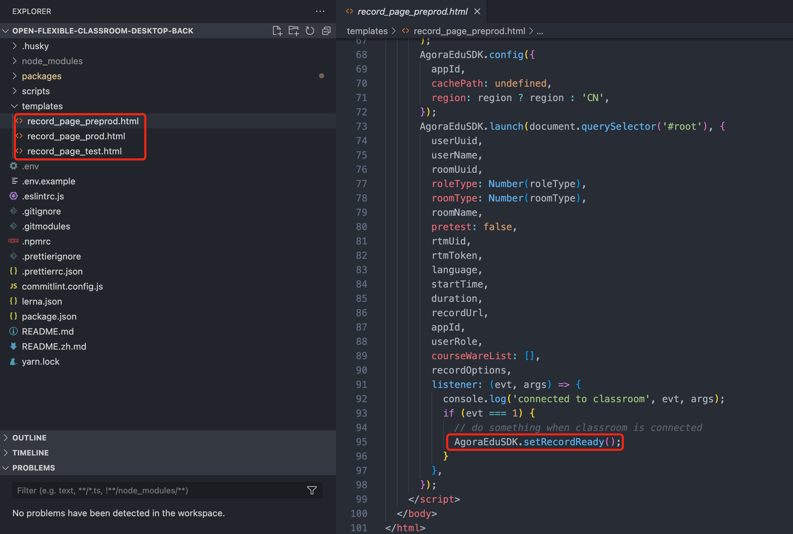

Agora 建议参照本页面在灵动课堂中进行录制，以保障录制的可靠性并提高录制文件的质量。

## 录制基本流程

灵动课堂中的录制为手动录制。具体流程如下：

1. 用户在灵动课题客户端点击录制按钮开启录制，如下图所示：

   

2. 客户端通知灵动课堂服务端录制开启。

3. 灵动课堂服务端上自动打开一个浏览器页面，跳转至 `launchOption` 中配置的 `recordURL`。

4. 灵动课堂服务端开始录制课堂内容。

如果你希望实现自动开始录制，可以在服务端监听[课堂开始事件](/cn/agora-class/agora_class_restful_api?platform=RESTful#获取课堂事件)，然后调用[设置录制状态](/cn/agora-class/agora_class_restful_api?platform=RESTful#设置录制状态)接口开启录制。

如果你想要自己实现课堂录制，可参考下图。图中标为紫色的步骤为你需要进行的操作。


对于你需要在服务端部署的待录制页面，可基于 [flexible-classroom-desktop](https://github.com/AgoraIO-Community/flexible-classroom-desktop) 仓库中 `templates/record_page_prod.html` 文件进行修改和调整，然后将修改后的 HTML 文件部署至你自己的 CDN。



## 启动课堂录制

无论你是在客户端还是服务端启动课堂录制，本质都是调用灵动课堂云服务[设置录制状态接口](/cn/agora-class/agora_class_restful_api?platform=RESTful#设置录制状态)。启动录制时，你需要关注以下参数：

- `mode`: 设为 `web`，启用[页面录制模式](/cn/Agora%20Platform/webpage_recording)。
- `rootUrl`: 待录制页面的根地址。灵动课堂云服务会自动在该 URL 后拼接 `roomUuid`、`roomType` 等参数，而待录制⻚面需要提取这些信息在调用 [launch](/cn/agora-class/agora_class_api_ref_web?platform=Web#launch) 方法时传入。
- `retryTimeout`: 重试超时时间，单位为秒。最多重试两次。

示例代码：

```json
{
    "mode": "web",
    "webRecordConfig": {
        "rootUrl":"https://xxx.yyy.zzz",
    },
    ...
    "retryTimeout": 60
}
```

设置 `retryTimeout` 后，你需要在录制⻚面调用 [launch](/cn/agora-class/agora_class_api_ref_web?platform=Web#launch) 方法设置 `listener` 参数监听枚举值为 `1` 的事件，`1` 代表⻚面加载完成。监听到该事件后，你需要调用以下接口，告知灵动课堂云服务待录制⻚面已经加载完成。如果灵动课堂云服务没有在 `retryTimeout` 内收到这个请求，则会重试录制。

- 接口原型

  - 方法：PUT
  - 路径：https://api.agora.io/edu/apps/{appId}/v2/rooms/{roomUUid}/records/ready

- 成功后会收到如下响应：

  ```json
  status: 200,
  body:{
      "msg": "Success",
      "code": 0,
      "ts": 1610167740309
  }
```

上述逻辑的示例代码如下：

```typescript
AgoraEduSDK.launch(document.querySelector(`#${this.elem.id}`), {
    ...
    listener: (evt) => {
        if ( evt === 1 ) {
        // Send a web request to notify the server side that the recording page was fully loaded.
        }
    }
})
```

如果你使用灵动课堂 1.1.5 之前的版本，你需要额外监听 `params` 以监听白板加载状态。示例代码如下：

```typescript
AgoraEduSDK.launch(document.querySelector(`#${this.elem.id}`), {
    ...
    listener: (evt, params) => {
        if ( evt === 1 && params.type === "whiteboard") {
        // Send a web request to notify the server side that the recording page was fully loaded.
        }
    }
})
```

## 获取录制状态

启动录制后，灵动课堂云服务会产生[录制状态变更](/cn/agora-class/agora_class_restful_api_event?platform=RESTful#录制状态变更)的事件。你可以通过[查询指定事件](/cn/agora-class/agora_class_restful_api?platform=Web#查询指定事件)或[获取课堂事件](/cn/agora-class/agora_class_restful_api?platform=Web#获取课堂事件)来获取录制状态。你需要关注录制状态变更事件中的 `reason` 字段：

- `1`: 正常开始录制。
- `2`: 正常停止录制。
- `3`: 重试后正常开始录制。
- `4`: 超时待重试。
- `5`: 重试次数达到上限后仍未成功，退出录制。

同时，客户端的[房间属性](/cn/agora-class/edu_context_api_ref_web_room?platform=Web#roomproperties)中录制状态也会发生变更。你可以基于服务端和客户端这两种方式进行后续业务开发。

## 去除录制文件开头的白屏

由于⻚面录制服务端加载待录制⻚面需要一段时间，但切片会在这之前开始，因此生成的录制文件开头会有一段时间的白屏。如果你想要去除白屏，需进行以下操作：

1. 在课堂开始前就调用灵动课堂云服务[设置录制状态接口](/cn/agora-class/agora_class_restful_api?platform=RESTful#设置录制状态)并将 `onhold` 参数设为 `true`。灵动课堂云服务会在启动页面录制任务后立即暂停录制。⻚面录制服务端会打开并渲染待录制页面，但不生成切片文件，而是加载好待录制⻚面后待命。示例包体如下：

   ```json
   {
       "mode": "web",
       "webRecordConfig": {
           "url": "https://xxx.yyy.zzz",
           "onhold": true
       }
   }
```

2. 当录制页面AgoraEduSDK.setRecordReady()调用完成后，即录制页面加载成功后，再调用更新录制设置接口，将 onhold 参数设置为 false 来正式开始录制，进行录制切片。示例包体如下：

   ```json
   {
       "webRecordConfig": {
           "onhold": false
       }
   }
```

## 提高屏幕共享清晰度

实际上课中，老师可能会通过屏幕共享来分享课件等内容。如果你对屏幕共享、白板等录制内容的清晰度要求较高，可在调用[设置录制状态接口](/cn/agora-class/agora_class_restful_api?platform=RESTful#设置录制状态)时设置以下参数：

- 将 `videoWidth` 设为 1920。
- 将 `videoHeight` 设为 1080。
- 将 `videoBitrate` 设为 2000。

示例包体如下：

```json
{
    "mode": "web",
    "webRecordConfig": {
        "url": "https://xxx.yyy.zzz",
        "videoWidth": 1920,
        "videoHeight": 1080,
        "videoBitrate": 2000
    }
}
```
